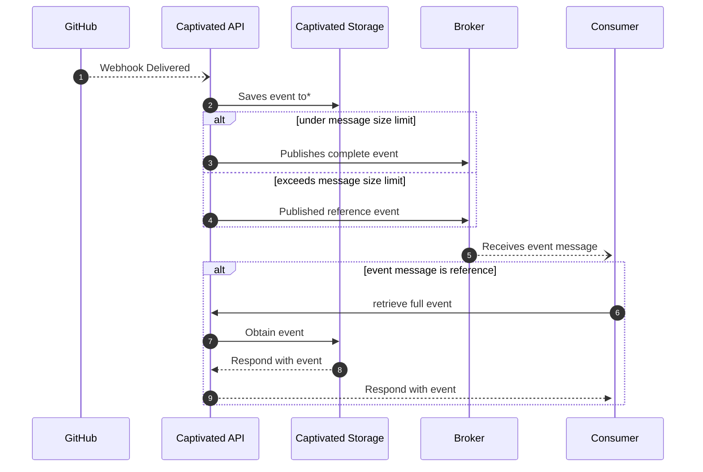

# Captivated

Listens to github webhooks and forwards to a broker.

This is currently configured to use Azure Service Bus as the broker and Azure Storage Account Blob for storage, but can be easily swapped to other technologies with updated implementations in `/server/services`.

## Sequence

1. GitHub webhook is delivered to Captivated API, payload it is validated against secret
2. Captivated stores the event payload to storage (some events are up to 25mb in size, many brokers max out at 1mb)
3. Captivated sends the event payload to a broker
4. In case the event payload is too large, a reference event is sent instead
5. The event/reference event is delivered to consumer
6. -9. If the event is a reference event, the consumer can retrieve the full payload from captivated's api

## Endpoints

Method | Endpoint      | Description
-------|---------------|-------------------------------------------------------------------------------
`POST` | `/event`      | the endpoint that receives the webhook event payload
`GET`  | `/event/{id}` | retrieve an event payload that was too large to send to the broker by the reference id

## Event Payload

Property | Value | Description
--|--|--
`id` | `string` | the event's id
`type` | `string` | the event type name
`deliveryId` | `string` | github's delivery unique id
`targetType` | `string` | the type of resource where the webhook was created
`targetId` | `string` | the unique identifier of the resource where the webhook was created
`data` | `object` or `null` | the event payload, or null if `isReference == true`
`isReference` | `boolean` | a value that indicates whether this event is a reference - if true, call `GET /events/{id}` to retrieve the non-reference event
