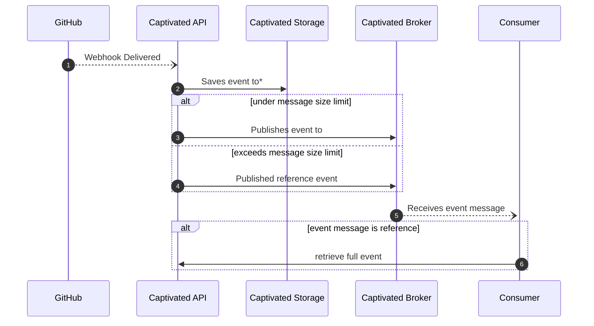

# Captivated

Listens to github webhooks and forwards to a broker.

1. GitHub webhook is delivered to Captivated API, payload it is validated against secret
2.

```mermaid
sequenceDiagram
  autonumber
  participant GH as GitHub
  participant API as Captivated API
  participant ST as Captivated Storage
  participant BR as Captivated Broker
  participant CR as Consumer

  GH--)API: Webhook Delivered

  API->>ST: Saves event to*

  alt under message size limit
  API->>BR: Publishes event to
  else exceeds message size limit
    API->>BR: Published reference event
  end

  activate CR
  BR--)CR: Receives event message

  alt event message is reference
    CR->>API: retrieve full event
  end
```
